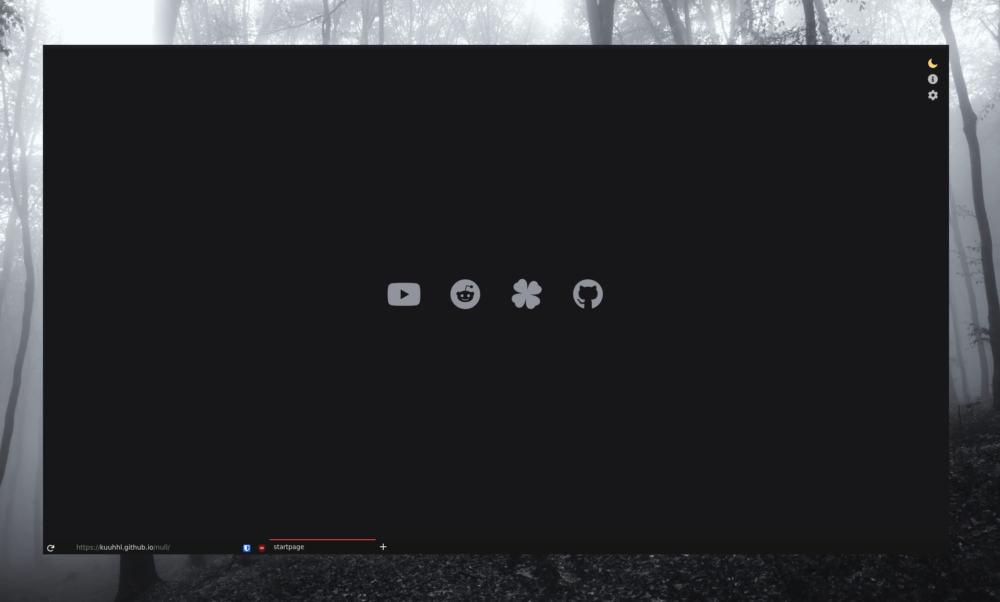

<h1>SimplerentFox</h1>
<b>🦊 Minimalist, Simple and Keyboard Centered</b>

# Modified in fork
* Removed windows version, keep only one-line version
* moved taskbar and tabs to bottom
* removed items from right-click-menu
* dark mode for right click-menu
* added back the line to indicate current tab

## Usage

> This userstyle was made for a keyboard centered usage, like Tilling Window Manager users or just cool people that loves them! 🤖
> In this section I show you some cool shortcuts you can use with this theme for a better experience

-   `Alt` You can access to the global menu for an extended options you need
-   `Alt + Left Arrow` You can go Back
-   `Alt + Right Arrow` You can go Forward
-   `Ctrl + L` focuses the URLBar, which is very useful for quick searches and bookmarks usage
-   `Ctrl + B` shows you the Bookmarks 
-   `Ctrl + H` shows you the History Bar
-   `Ctrl + T` Opens a new Tab
-   `Ctrl + W` Closes a Tab
-   `Ctrl + Shift + T` Re-opens a tab that you just closed
-   `Ctrl + R` Refresh the page you're on
-   `Ctrl + Shift + A` Quick open for Add-Ons

## Startpage

The startpage I am using in the screenshot is a modified version of the [null](https://github.com/sadparadiseinhell/null) startpage by sadparadiseinhell.
